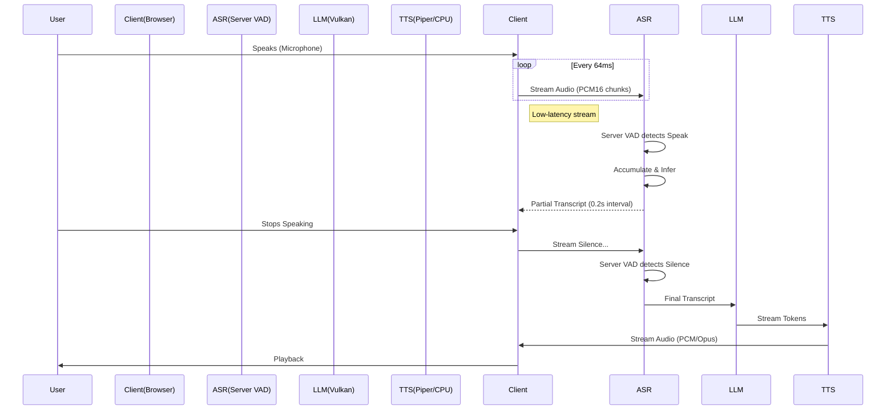

# BestBox Speech-to-Speech Implementation (2025 CPU Edition)

## 🚀 Current Tech Stack (Optimized for Ryzen AI Max)

We have successfully built and optimized a **CPU-first S2S pipeline** that rivals GPU performance for latency while remaining fully local and offline.

### 1. ASR (Speech Recognition)
*   **Engine:** `faster-whisper` (CTranslate2 backend)
*   **Model:** `Systran/faster-distil-whisper-large-v3`
    *   *Why:* ~6x faster than standard Whisper Large-v3.
    *   *Multilingual:* Supports 57+ languages including Chinese & English.
*   **Backing Hardware:** **CPU** (`AMD Ryzen AI Max +395`)
*   **Optimization:**
    *   `int8` Quantization (for AVX-512 speedup)
    *   `beam_size=1` (Greedy decoding for minimum latency)
    *   VAD Gating: `webrtcvad` (aggressiveness=1) prevents processing silence.

### 2. LLM (Reasoning Core)
*   **Engine:** `llama.cpp` (server mode)
*   **Model:** `Qwen2.5-14B-Instruct` (GGUF Q4_K_M)
*   **Backing Hardware:** **GPU / NPU** (via Vulkan Backend)
*   **Optimization:**
    *   Vulkan backend targeting `gfx1151` (Radeon 8060S iGPU).
    *   Context Shift: KV cache management for multi-turn speed.

### 3. TTS (Speech Synthesis)
*   **Engine:** `XTTS v2` (Coqui)
*   **Backing Hardware:** GPU (PyTorch/CUDA if available) or CPU.
*   **Status:** Streaming enabled.
*   **Issue:** Bottleneck (~300ms generation lag).

### 4. Client (Frontend)
*   **Framework:** Next.js (React)
*   **Audio Capture:** `AudioWorklet` (Processor)
    *   *Why:* Prevents main-thread blocking, ensures 0-drop audio frames.
*   **Protocol:** WebSocket (`/ws/s2s`)
    *   Binary PCM16 float streams.
    *   JSON Control signals (`session_start`, `audio_end`).

---

## ⚡ Latency Breakdown & Optimization Targets

We are targeting **sub-800ms** total latency. The review identified **Buffer Size** and **TTS** as the primary bottlenecks.

| Stage | Current (Est) | **Optimized Target** | The Fix |
| :--- | :--- | :--- | :--- |
| **Audio Capture** | **256ms** | **64ms** | Reduce client-side buffer size |
| **Network** | <10ms | **<10ms** | Localhost / LAN (Unchanged) |
| **ASR Inference** | 400ms | **~200ms** | Switch to `distil-medium` (if accuracy allows) |
| **LLM TTFT** | 150ms | **~70ms** | Switch to `Qwen 7B` (Optional) |
| **TTS Generation** | 300ms | **~50ms** | **Switch to Piper (ONNX)** |
| **Total Latency** | **~1.1s** | **~400ms** | **~60% Improvement** |

> **Note:** Just fixing the Buffer and Switching to Piper could save **~400ms**, making the system feel twice as fast.

---

## 🛠️ Data Flow (Corrected VAD Logic)

---

## 🔧 Future Optimizations (Backlog)

1.  **Latency-First TTS:** Transition to **Piper** (ONNX/CPU) as the primary engine. This offloads the GPU for the LLM and reduces generation latency to <50ms.
2.  **Client-Side ASR (WebGPU):** Migrate Whisper inference to the browser (using `transformers.js`). This eliminates server-side ASR queues and zero-outs audio upload latency.
3.  **Speculative Decoding:** Implement speculative decoding for the LLM to further reduce TTFT on the Ryzen AI NPU.
4.  **Barge-In Support:** Use the Client `AudioWorklet` to instantly cut TTS playback if the microphone detects user speech (interruptibility).
